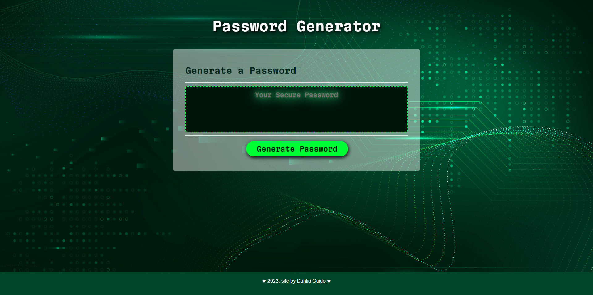

# JavaScript Password Generator
Module 3 Challenge. 

Randomly generated passwords can provide greater security for sensitive data. This application runs directly in the browser and enables users to generate random passwords based on criteria that they’ve selected.

Powered by a combination of dynamic HTML, CSS, and JavaScript code to create an interactive experience.The functionality of this password generator also provides a responsive layout that adapts to various screen sizes, offering a convenient solution for creating strong and reliable passwords.

![JavaScript][js-url]
![HTML][html-url]
![CSS][css-url]

## Deployed Application
You can view the live application
[here ➡️](https://cyphernyx.github.io/password-randomizer/)


## Features

1. Password Generation Button: Users can click on a "Generate Password" button to initiate the password generation process.

2. Password Criteria Prompts: Upon clicking the button, a series of prompts are presented to the user, allowing them to specify their password criteria.

3. Password Length Selection: Users can enter a desired password length, which should be at least 8 characters and no more than 128 characters.

4. Character Type Selection: Users can choose to include lowercase, uppercase, numeric, and/or special characters in the password by confirming their selection in the prompts.

5. Input Validation: The application validates user input to ensure that a valid password length is chosen and at least one character type is selected.

6. Password Generation: Once all prompts are answered and the criteria are validated, the application generates a password that matches the selected criteria.

7. Password Display: The generated password is displayed to the user directly on the page.

8. Security Enhancement: Randomly generated passwords offer greater security for sensitive data.

9. Clean and Polished Interface: The application features a clean and polished user interface, providing a pleasant user experience.

10. Responsive Design: The user interface is responsive and adapts to different screen sizes, ensuring a consistent experience across devices.

## Installation

Clone the repository:

```sh
git clone git@github.com:CypherNyx/password-randomizer.git
```

## Usage

After clicking the green 'Generate Password' button, you will be prompted to enter the desired length of your password, as well as approve desired character types by clicking the 'OK' button.


## Credits
Background image [Image by rawpixel.com on Freepik]("https://www.freepik.com/free-vector/green-futuristic-waves-background-with-computer-code-technology_16406692.htm#query=security%20wallpaper&position=17&from_view=search&track=ais")


